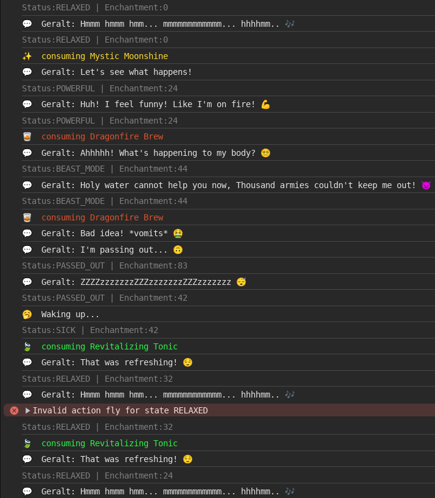

# Finite State Machine Game

<br/>
<div> 
  
</div>

## Overview

This repository is a fun exploration of **finite state machines**, featuring a **simple game inspired by the Witcher series**. Using JavaScript and the XState library, we model character behavior through potion effects. The machine is built in 3 ways: 1- as a JavaScript object, 2- with class syntax, and 3- using the XState library, offering a hands-on look at finite state machines in action.

<span style="color: #AC45BD">🟣 **tl;dr**:</span> A player tries different potions and ends up in different states (might even die!).

<br/>
<div>

</div>
<br/>

## Table of Contents

- [Project Structure](#project-structure)
- [Installation](#installation)
- [Usage](#usage)
- [Contributing](#contributing)
- [License](#license)

## Project Structure

The project is divided into three main parts:

- **JavaScript Object Implementation (`1-js-object.js`)**: This file contains a simple object-based representation of the Witcher character's finite state machine. It includes methods for consuming potions and transitioning between states.

- **JavaScript Class Implementation (`2-js-class.js`)**: This file shows a more structured approach using classes to encapsulate the finite state machine logic for the Witcher character.

<br/>
<div>

</div>
<br/>

- **XState Implementation (`3-xstate.mjs`)**: This file utilizes the XState library to define the finite state machine as a statechart. It includes actions and guards to handle the transitions between states based on the character's enchantment level.

<br/>
<div>

</div>
<br/>

[Live XState Demo](https://stately.ai/registry/editor/90cf5b42-45d6-4568-b9b1-8d9d647456fd?mode=Design&machineId=1c4db223-7e2c-441e-8e0a-0903238df3d0)

<hr>
<br/>
Each part of the project demonstrates a different way to implement the same concept, providing a comparison of approaches.

## Installation

To install and run the project, clone the repository and install the required dependencies using npm:

```bash
git clone https://github.com/b-amir/fsm-game.git
cd fsm-game
npm install
```

## Usage

After installation, you can execute the different implementations using Node.js:

```bash
node  1-js-object.js
node  2-js-class.js
node  3-xstate.mjs
```

Each script will run the game simulation, simulating the character's behavior based on the finite state machine.

## Contributing

Contributions are welcome! Please read the [CONTRIBUTING.md](CONTRIBUTING.md) for details on our code of conduct and the process for submitting pull requests.

## License

This project is licensed under the MIT License - see the [LICENSE.md](LICENSE.md) file for details.
